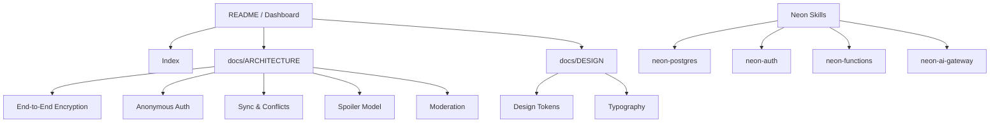

# Dusk Shingle — Project Content Index

> **Project Dashboard**: [[README]] | **Vault Index**: [[Index]] | **Projects Index**: [[01-PROJECTS/Projects Index]]

---

## Project Overview

**Dusk Shingle** — A quiet, reader-facing publication surface with anonymous accounts, end-to-end encrypted reading-state sync, and spoiler-aware discussions.

| Aspect | Detail |
|--------|--------|
| **Type** | Web application (Vite + React SPA + Vercel Function) |
| **Status** | Active development |
| **Architecture** | [[docs/ARCHITECTURE]] |
| **Design System** | [[docs/DESIGN]] |
| **Deployment** | Vercel + Neon (Lakebase Postgres) |

---

## Documentation Map

### Architecture & Design
- [[docs/ARCHITECTURE]] — Architecture, security & privacy (E2EE, anonymous auth, sync, moderation)
- [[docs/DESIGN]] — Design system (tokens, typography, surfaces, dark mode)

### Content
- [[src/content/chapters/chapter-001]] — Chapter 001: The Dry Pump (fiction)

### Skills & References
- [[.agents/skills/neon/SKILL|Neon Skill]] — Neon backend primitives overview
- [[.agents/skills/neon-postgres/SKILL|Neon Postgres Skill]] — SQL, schema, search, autoscaling
- [[.agents/skills/neon/references/auth|Neon Auth Reference]] — Managed Better Auth setup
- [[.agents/skills/neon/references/claimable-neon|Claimable Neon]] — Starting without Neon account
- [[.agents/skills/neon/references/function-triggers|Function Triggers]] — Cron & storage triggers
- [[.agents/skills/neon/references/logs-loki|Logs & Loki]] — Branch-scoped observability
- [[.agents/skills/neon/references/parse-env|Parse Env]] — Type-safe env vars
- [[.agents/skills/neon/references/sdk|Neon SDK]] — Manage resources from TypeScript
- [[.agents/skills/neon-postgres/references/full-text-search|Full-Text Search]] — BM25 search
- [[.agents/skills/neon-postgres/references/hybrid-search|Hybrid Search]] — Vector + text
- [[.agents/skills/neon-postgres/references/lakebase-search-drizzle|Lakebase Search Drizzle]] — Drizzle integration
- [[.agents/skills/neon-postgres/references/vector-search|Vector Search]] — pgvector

---

## Folder Structure

```
dusk-shingle/
├── README.md                 ← Project dashboard
├── Index.md                  ← This file
├── docs/
│   ├── ARCHITECTURE.md       ← Architecture, security, privacy
│   └── DESIGN.md             ← Design system
├── src/
│   └── content/
│       └── chapters/
│           └── chapter-001.md
├── .agents/
│   └── skills/
│       ├── neon/
│       │   ├── SKILL.md
│       │   └── references/
│       │       ├── auth.md
│       │       ├── claimable-neon.md
│       │       ├── function-triggers.md
│       │       ├── logs-loki.md
│       │       ├── parse-env.md
│       │       └── sdk.md
│       └── neon-postgres/
│           ├── SKILL.md
│           └── references/
│               ├── full-text-search.md
│               ├── hybrid-search.md
│               ├── lakebase-search-drizzle.md
│               └── vector-search.md
├── node_modules/             ← Dependencies (excluded from vault)
└── ...
```

---

## Key Relationships



---

## Maintenance

- **Updated**: 2026-09-19 (initial creation)
- **Owner**: Project lead
- **Sync**: Update when adding/removing/moving project notes
- **Link to vault**: This index linked from [[Index]] and [[01-PROJECTS/Projects Index]]

---

## Quick Navigation

| Area | Link |
|------|------|
| **Dashboard** | [[README]] |
| **Architecture** | [[docs/ARCHITECTURE]] |
| **Design System** | [[docs/DESIGN]] |
| **Content** | [[src/content/chapters/chapter-001]] |
| **Neon Skills** | [[.agents/skills/neon/SKILL]] |